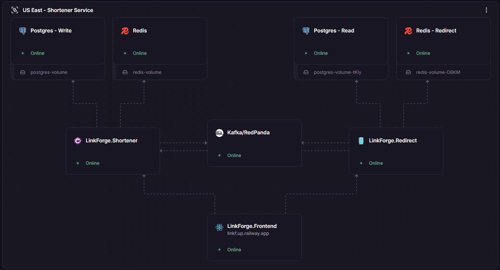
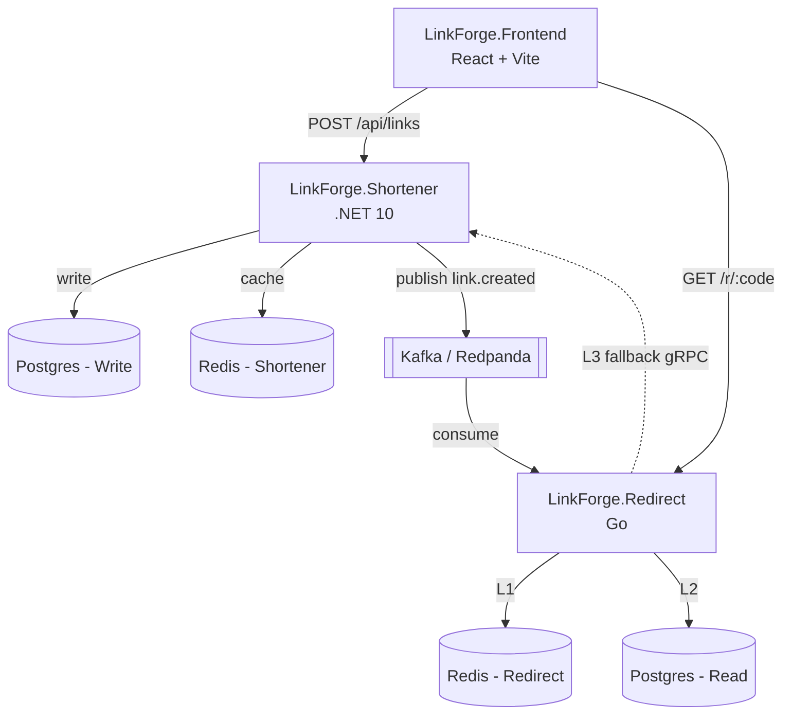
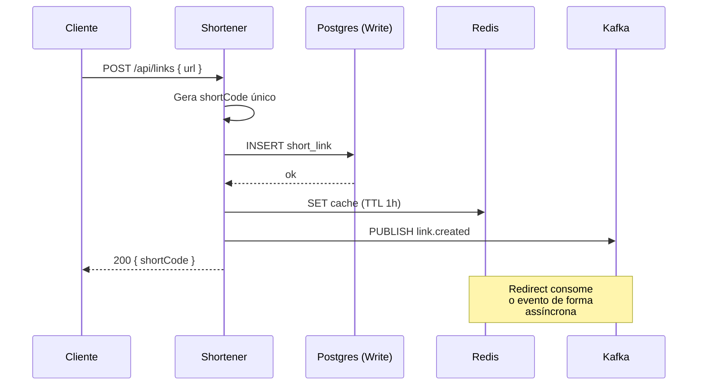

<p align="center">
  
</p>

<p align="center">
  <a href="README.md"></a>
  <a href="README.en.md"></a>
</p>

<p align="center">
  <a href="https://linkf.up.railway.app/">Aplicação</a> ·
  <a href="#como-rodar-local">Como rodar</a> ·
  <a href="#arquitetura">Arquitetura</a> ·
  <a href="#decisões-técnicas">Decisões técnicas</a> ·
  <a href="https://www.linkedin.com/in/leonardolima-art/">Linkedin</a>
</p>

<p align="center">
  
</p>

---

## Sobre o projeto

LinkForge é um encurtador de URL. Apesar da ideia ser simples, o verdadeiro proposito é a arquitetura por trás dela.

Construí esse projeto para praticar arquitetura de microsserviços, sistemas escaláveis (horizontal e vertical), Clean Architecture, DDD e, principalmente, como projetar sistemas considerando que eles **vão falhar**. A intenção era ir além de mais um repositório esquecido no GitHub. Queria algo em produção, acessível para qualquer pessoa testar.

Algumas decisões aqui são over-engineered de propósito. Um encurtador simples não exigiria três níveis de cache, fallback via gRPC ou idempotência no produtor Kafka. Foram escolhas feitas para exercitar conceitos. Cheguei a considerar multi-região, mas o orçamento do Railway (US$ 5/mês para o projeto inteiro) não comporta para esse cenário, por enquanto.

## Features

Hoje o usuário consegue:

- Encurtar uma URL
- Acessar o link curto e ser redirecionado

Como funciona:

- **Cache em 3 níveis** no caminho do redirect: Redis (L1), Postgres (L2) e gRPC fallback (L3)
- **Singleflight** no redirect, se milhões de requisições chegam simultaneamente pelo mesmo `shortCode`, apenas uma vai ao banco e o resultado é replicado para as demais
- **Event-driven** entre serviços. O Shortener publica `link.created` no Kafka, o Redirect consome e popula o próprio banco. Sem acoplamento direto
- **Fallback gRPC** caso o Kafka falhe. O Redirect ainda resolve o link consultando o Shortener via RPC, garantindo consistência
- **Produtor Kafka idempotente** e **schema versioning** no evento. O consumidor descarta versões não suportadas
- **Rate limiting** em todos os serviços/api, proteção contra abuso e contra esgotar o orçamento
- **Health checks** (`/health` liveness e `/ready` readiness com Postgres e Redis), API key entre serviços e CORS configurado

## Arquitetura

Cada microsserviço tem seu próprio Postgres e seu próprio Redis. Os dados não são compartilhados diretamente entre os serviços. O Shortener publica eventos no Kafka e o Redirect consome para popular o próprio banco. Caso o Kafka falhe, o Redirect recorre ao gRPC como fallback.



### Serviços

- **LinkForge.Shortener** (.NET 10): write path. Recebe a URL, valida, gera o `shortCode`, persiste e publica o evento. A carga é previsível e a escala vertical faz mais sentido nesse perfil.
- **LinkForge.Redirect** (Go): hot path. Resolve `shortCode → URL` com baixa latência. Stateless, escala horizontal sem complicações.
- **LinkForge.Frontend** (React): interface para criação e acesso aos links.
- **Kafka/Redpanda**: barramento de eventos que desacopla Shortener e Redirect.

### Fluxo de encurtamento



O Shortener só retorna sucesso ao cliente depois que o link foi efetivamente persistido. Essa ordem garante que o fallback funcione. Se o Redirect cai no L3 há certeza de que o link existe na fonte da verdade.

### Fluxo de redirect (cache em 3 níveis)


O L3 idealmente nunca deve ser acionado. Ele existe para garantir que mesmo se o Kafka falhar na entrega do evento, o redirect continue operacional. É uma rede de segurança da arquitetura.

## Stack

- **Shortener (.NET 10)**: ASP.NET Core, EF Core (Postgres), Confluent.Kafka, gRPC server. Testes com xUnit, FluentAssertions, NSubstitute e Testcontainers.
- **Redirect (Go 1.26)**: Gin, pgx/v5 + sqlc, go-redis/v9, segmentio/kafka-go, gRPC client, `golang.org/x/sync/singleflight`, viper, slog. Testes com testify e testcontainers-go (Postgres, Redis, Redpanda).
- **Frontend**: React 19, Vite 8, React Router 7.
- **Infra**: Postgres 16, Redis 7, Redpanda, Docker Compose (local), Railway (prod), GitHub Actions (CI/CD).

### Por que .NET no Shortener

.NET é minha stack principal. O ecossistema é integrado de ponta a ponta (Entity Framework, ASP.NET Core, gRPC, Kafka client), com uma única organização mantendo o conjunto. O footprint é razoável, algo entre 80 a 150MB em runtime para uma API enxuta e domínios mais ricos se beneficiam da linguagem.

### Por que Go no Redirect

O Redirect é o hot path. Se alguém com grande número de seguidores, um influêncer, divulga um link encurtado, milhões de cliques podem chegar pelo mesmo `shortCode`. O requisito aqui é latência baixa e footprint reduzido. Goroutines começam na ordem de KB, threads .NET na ordem de MB, e essa diferença reflete diretamente no custo de infraestrutura a curto e longo prazo.

Sobre o trade off, Go é mais verboso e oferece menos abstrações prontas que .NET, mas nesse caso de uso acaba compensando.

### Por que gRPC (e não HTTP) no fallback

Menor latência, payload binário e contrato tipado via Protobuf entre os serviços. O custo é configuração mais trabalhosa, mas como o fallback é interno (serviço-a-serviço), o esforço é justificável.

### Por que React no frontend

Para este projeto qualquer framework atenderia (Svelte, Angular e outros), com impacto técnico irrelevante. Optei por React pela popularidade, quem clona o repositório encontra uma stack familiar.

## Decisões técnicas

### Bancos separados

Cada microsserviço tem seu próprio Postgres e seu próprio Redis. O Postgres do Shortener é a fonte da verdade(escrita). O Postgres do Redirect funciona como réplica lógica, populada via Kafka (leitura). Nenhum dado é compartilhado diretamente entre os serviços.

### Cache armazena o objeto completo (não só a URL)

Originalmente o cache do Shortener armazenava apenas a URL, quando implementei o fallback gRPC, surgiu a necessidade de incluir o `id` também. Se o Redirect cai no L3, ele precisa popular o próprio Postgres mantendo o mesmo `id` da fonte da verdade. Caso contrário ocorre inconsistência ou, em cenário pior, violação de chave única.

Refatorei o cache para armazenar o objeto completo (`id`, `shortCode`, `originalUrl`, `createdAt`). Pequena mudança no schema, problema grande resolvido.

### Produtor Kafka idempotente

Idempotência habilitada no producer (`EnableIdempotence=true`) garante que, em caso de retry, o Kafka não duplique mensagens. Combinado com o schema versioning no payload, a evolução de contrato fica segura. O consumidor descarta versões que não conhece em vez de processá-las incorretamente.

### Rate limiting como proteção de orçamento

Não é só mecanismo de segurança contra DDoS, é proteção direta do budget no railway. Em ambientes cloud, requisições mal intencionadas custam dinheiro. Em produção utilizo 10 RPS com burst de 20 no Redirect, e 10 criações por janela de 30 segundos no Shortener. Todos os valores são configuráveis via variáveis de ambiente.

### Redirect é stateless

Não retém estado em memória entre requisições. Subir várias instâncias do Redirect é só questão de configuração no Railway, o singleflight opera por instância, dispensando coordenação distribuída.

## Modelo de dados

**Tabela `short_links`** (em ambos os Postgres):

| Campo | Tipo | Observação |
|---|---|---|
| `id` | UUID | PK |
| `short_code` | TEXT | Único, indexado |
| `original_url` | TEXT | |
| `created_at` | TIMESTAMP | |

**Tópico Kafka `linkforge.links.created`**, payload JSON:

```json
{
  "schema_version": 1,
  "id": "uuid",
  "short_code": "abc12345",
  "original_url": "https://...",
  "created_at": "2026-05-30T10:00:00Z"
}
```

A `key` da mensagem é o `short_code`, garantindo ordenação dentro da mesma chave.

## API

### `POST /api/links`

Cria um link curto.

```bash
curl -X POST https://linkf.up.railway.app/api/links \
  -H "Content-Type: application/json" \
  -d '{"url": "https://example.com/uma-url-bem-longa"}'
```

Resposta:
```json
{ "shortCode": "abc12345" }
```

### `GET /r/{shortCode}`

Redireciona para a URL original (HTTP 302). Retorna 404 se o código não existir.

### `GET /health` e `GET /ready` (Redirect)

`/health` retorna 200 enquanto o processo está em execução. `/ready` testa Postgres e Redis antes de responder, sendo utilizado pelo Railway para orquestração.

### gRPC `LinkService.Resolve` (interno)

Não exposto publicamente. Utilizado pelo Redirect no L3 fallback. Contrato definido em [proto/linkforge/v1/link_service.proto](proto/linkforge/v1/link_service.proto), protegido por API key.

## Como rodar local

### Docker (recomendado)

Precisa apenas de **Docker**. Todo o ambiente sobe via Compose.

```bash
git clone https://github.com/leonardolimaArt/linkforge.git
cd linkforge
cp .env.example .env
docker compose up --build
```

URLs após a inicialização:

| Serviço | URL |
|---|---|
| Frontend | http://localhost:3000 |
| Shortener API | http://localhost:8080 |
| Redirect | http://localhost:8081 |
| Redpanda Console (UI dos tópicos Kafka) | http://localhost:8090 |
| Postgres (Shortener) | localhost:5432 |
| Postgres (Redirect) | localhost:5433 |
| Redis (Shortener) | localhost:6379 |
| Redis (Redirect) | localhost:6380 |

### Local

Frameworks e bibliotecas são restaurados pelo gerenciador de pacotes do serviço.

| Serviço | SDK | Frameworks principais | Ferramentas secundarias | Setup |
|---|---|---|---|---|
| Shortener | .NET SDK 10 | ASP.NET Core, EF Core (Npgsql), Confluent.Kafka, Grpc.AspNetCore, Grpc.Tools, Scalar.AspNetCore, xUnit, FluentAssertions, NSubstitute, Testcontainers | `dotnet-ef` (migrations) | `dotnet restore LinkForge.Shortener/LinkForge.Shortener.slnx` |
| Redirect | Go 1.26+ | Gin, pgx/v5, sqlc-gen, go-redis/v9, segmentio/kafka-go, gRPC, singleflight, viper, slog, testify, testcontainers-go | `sqlc`, `protoc`+`protoc-gen-go`+`protoc-gen-go-grpc`, `make` (regen de código) | `cd LinkForge.Redirect && go mod download` |
| Frontend | Node 24+ | React 19, Vite 8, React Router 7, FontAwesome, ESLint | — | `cd LinkForge.FrontEnd && npm ci` |

Os arquivos gerados do gRPC (`.pb.go` e `LinkServiceGrpc.cs`) são versionados. Para gerar, deve rodar `make proto-gen` em `LinkForge.Redirect/`. O workflow `proto-check.yml` valida no CI que estão atualizados.

Docker continua necessário para os testes de integração, Postgres, Redis e Redpanda em containers descartáveis via Testcontainers.

## Testes

Cobertura focada nas features. Para executar pode ser pelos comandos abaixo ou pelo explorador de testes se estiver usando vscode:

**Shortener (.NET)**, unit e integration com Testcontainers:
```bash
dotnet test LinkForge.Shortener/LinkForge.Shortener.slnx
```

**Redirect (Go)**, unit e integration com testcontainers-go:
```bash
cd LinkForge.Redirect
go test ./internal/... -race
go test ./test/integration/...
```

Os testes de integração sobem Postgres, Redis e Redpanda em containers descartáveis, então o Docker precisa estar em execução.

## CI/CD

GitHub Actions com **4 workflows separados** para deploy independente:

- `shortener.yml`: build, test e deploy do Shortener
- `redirect.yml`: build, test (unit e integration) e deploy do Redirect
- `frontend.yml`: lint, build e deploy do Frontend
- `proto-check.yml`: valida que os arquivos gerados do Protobuf estão sincronizados com `.proto`

Cada workflow utiliza **path filters**, disparando apenas quando há alterações no respectivo serviço (ou no contrato proto compartilhado). Deploy automático no merge para `main`, com aprovação manual no environment de produção.

## Custo no Railway

O projeto roda no plano de US$ 5/mês. Para um portfólio, atende com folga. O Railway entrega hardware competente mesmo no plano básico, suporta escala horizontal e vertical, e aplica auto-sleep aos serviços ociosos, reduzindo o custo nas horas sem tráfego.

A escolha do Railway veio justamente disso. Replicar essa mesma arquitetura na AWS ou Azure custaria muito mais, o que não faz sentido em um projeto de portfólio. A escolha de Go no hot path e o rate limit em todos os serviços fazem parte da estratégia para ficar dentro do orçamento.

## Roadmap

- **Identity service**: autenticação OAuth2/JWT (login com Google). Links de usuários autenticados permanecem indefinidamente, links anônimos expiram após alguns dias sem acesso
- **Analytics service**: métricas de cliques por link, dashboard global para o dono
- **Observabilidade**: Prometheus e Grafana para métricas

## Estrutura do repositório

Monorepo (sou só um dev, fragmentar não traria benefício):

```
linkforge/
├── .github/workflows/         # CI/CD por serviço
├── proto/linkforge/v1/        # Contrato gRPC compartilhado
├── LinkForge.Shortener/       # Serviço .NET (write path)
├── LinkForge.Redirect/        # Serviço Go (hot path)
├── LinkForge.FrontEnd/        # React + Vite
└── docker-compose.yml         # Ambiente local completo
```

Cada serviço tem seu próprio `Dockerfile` e pode ser feito o build e deploy individual.

A Clean Architecture aplicada no Shortener é pragmática. Segui os princípios sem aderir cegamente ao formato. A regra existe para servir o projeto, não o contrário.

[algo sobre a cidade da raposa](https://i.ytimg.com/vi/Qy5N4YJ6aVo/sddefault.jpg)

