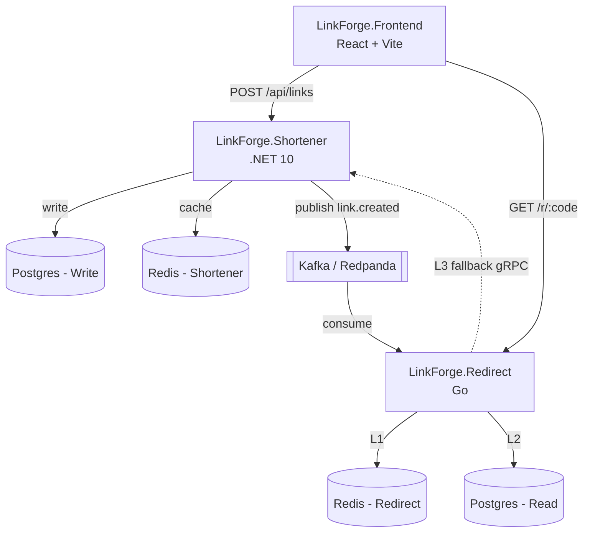
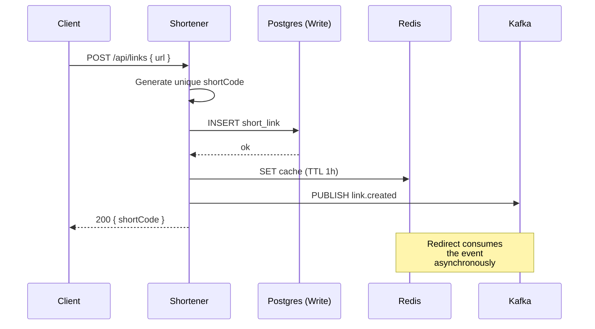
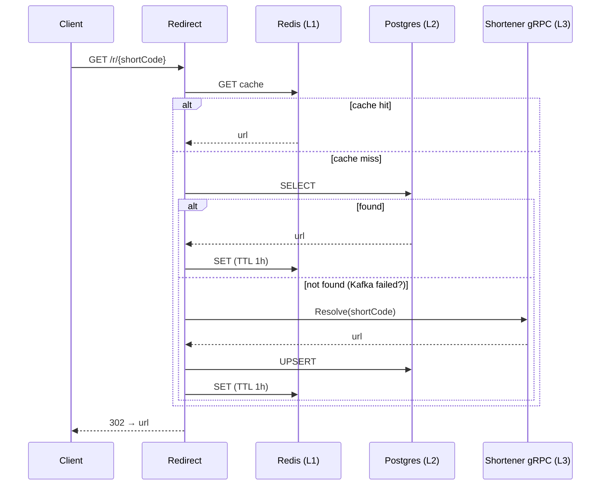

<p align="center">
  
</p>

<p align="center">
  <a href="README.md"></a>
    <a href="README.pt.md"></a>
</p>

<p align="center">
  <a href="https://linkf.up.railway.app/">App</a> ·
  <a href="#how-to-run-locally">How to run</a> ·
  <a href="#architecture">Architecture</a> ·
  <a href="#technical-decisions">Technical decisions</a> ·
  <a href="https://www.linkedin.com/in/leonardolima-art/">LinkedIn</a>
</p>

<p align="center">
  
</p>

---

## About the project

LinkForge is a URL shortener. The idea is simple on purpose, the real point is the architecture behind it.

I built this project to practice microservices architecture, scalable systems (both horizontally and vertically), Clean Architecture, DDD and, above all, how to design systems assuming they **will fail**. The goal was to go beyond just another forgotten GitHub repository. I wanted something running in production, accessible for anyone to try.

Some decisions here are over-engineered on purpose. A simple shortener would not require three cache layers, a gRPC fallback or an idempotent Kafka producer. These were choices made to exercise concepts. I even considered multi-region, but the Railway budget (US$ 5/month for the whole project) does not cover that scenario for now.

## Features

What the user can do today:

- Shorten a URL
- Access the short link and get redirected

How it works under the hood:

- **3-level cache** on the redirect path: Redis (L1), Postgres (L2) and gRPC fallback (L3)
- **Singleflight** in the redirect, if millions of requests hit the same `shortCode` simultaneously, only one goes to the database and the result is replicated to the others
- **Event-driven** between services. The Shortener publishes `link.created` to Kafka, the Redirect consumes and populates its own database. No direct coupling
- **gRPC fallback** in case Kafka fails. The Redirect still resolves the link by querying the Shortener via RPC, ensuring consistency
- **Idempotent Kafka producer** and **schema versioning** in the event. The consumer drops unsupported versions
- **Rate limiting** on every service/api, protection against abuse and against exhausting the budget
- **Health checks** (`/health` liveness and `/ready` readiness with Postgres and Redis), API key between services and CORS configured

## Architecture

Each microservice has its own Postgres and its own Redis. Data is not shared directly between services. The Shortener publishes events to Kafka and the Redirect consumes them to populate its own database. If Kafka fails, the Redirect falls back to gRPC.



### Services

- **LinkForge.Shortener** (.NET 10): write path. Receives the URL, validates, generates the `shortCode`, persists and publishes the event. Load is predictable and vertical scaling makes more sense for this profile.
- **LinkForge.Redirect** (Go): hot path. Resolves `shortCode → URL` with low latency. Stateless, scales horizontally without friction.
- **LinkForge.Frontend** (React): interface to create and access links.
- **Kafka/Redpanda**: event bus that decouples Shortener and Redirect.

### Shortening flow



The Shortener only returns success to the client after the link has actually been persisted. This ordering is what guarantees the fallback works. If the Redirect hits L3, there is certainty that the link exists in the source of truth.

### Redirect flow (3-level cache)



The L3 should ideally never be triggered. It exists to make sure that, even if Kafka fails to deliver the event, the redirect keeps working. It is a safety net of the architecture.

## Stack

- **Shortener (.NET 10)**: ASP.NET Core, EF Core (Postgres), Confluent.Kafka, gRPC server. Tests with xUnit, FluentAssertions, NSubstitute and Testcontainers.
- **Redirect (Go 1.26)**: Gin, pgx/v5 + sqlc, go-redis/v9, segmentio/kafka-go, gRPC client, `golang.org/x/sync/singleflight`, viper, slog. Tests with testify and testcontainers-go (Postgres, Redis, Redpanda).
- **Frontend**: React 19, Vite 8, React Router 7.
- **Infra**: Postgres 16, Redis 7, Redpanda, Docker Compose (local), Railway (prod), GitHub Actions (CI/CD).

### Why .NET for the Shortener

.NET is my main stack. The ecosystem is integrated end to end (Entity Framework, ASP.NET Core, gRPC, Kafka client), with a single organization maintaining the whole set. Footprint is reasonable, around 80 to 150MB at runtime for a lean API, and richer domains benefit from the expressiveness of the language.

### Why Go for the Redirect

The Redirect is the hot path. If someone with a large following, an influencer, posts a shortened link, millions of clicks can hit the same `shortCode`. The requirement here is low latency and small footprint. Goroutines start at the KB scale, .NET threads start at the MB scale, and that difference reflects directly on infrastructure cost in the short and long term.

About the trade-off, Go is more verbose and offers fewer ready-made abstractions than .NET, but for this use case it ends up paying off.

### Why gRPC (and not HTTP) for the fallback

Lower latency, binary payload and a strongly typed contract via Protobuf between the services. The cost is more setup work, but since the fallback is internal (service-to-service), the effort is justified.

### Why React for the frontend

Any framework would do for this project (Svelte, Angular and others), with irrelevant technical impact. I chose React because of its popularity, whoever clones the repository finds a familiar stack.

## Technical decisions

### Separate databases

Each microservice has its own Postgres and its own Redis. The Shortener's Postgres is the source of truth (writes). The Redirect's Postgres works as a logical replica, populated via Kafka (reads). No data is shared directly between services.

### Cache stores the full object (not just the URL)

Originally the Shortener's cache stored only the URL. When I implemented the gRPC fallback, I needed to include the `id` as well. If the Redirect falls back to L3, it needs to populate its own Postgres keeping the same `id` of the source of truth. Otherwise inconsistency happens or, worse, a unique key violation.

I refactored the cache to store the full object (`id`, `shortCode`, `originalUrl`, `createdAt`). Small change in schema, big problem solved.

### Idempotent Kafka producer

Idempotency enabled on the producer (`EnableIdempotence=true`) ensures that, on retry, Kafka does not duplicate messages. Combined with schema versioning in the payload, contract evolution stays safe. The consumer drops versions it does not understand instead of processing them incorrectly.

### Rate limiting as budget protection

It is not just a security mechanism against DDoS, it is direct protection of the Railway budget. In cloud environments, malicious requests cost real money. In production I use 10 RPS with burst of 20 on the Redirect, and 10 creations per 30-second window on the Shortener. All values are configurable via environment variables.

### Redirect is stateless

It does not keep state in memory between requests. Spinning up multiple Redirect instances is just a matter of configuration on Railway, the singleflight operates per instance, with no need for distributed coordination.

## Data model

**Table `short_links`** (on both Postgres):

| Field | Type | Note |
|---|---|---|
| `id` | UUID | PK |
| `short_code` | TEXT | Unique, indexed |
| `original_url` | TEXT | |
| `created_at` | TIMESTAMP | |

**Kafka topic `linkforge.links.created`**, JSON payload:

```json
{
  "schema_version": 1,
  "id": "uuid",
  "short_code": "abc12345",
  "original_url": "https://...",
  "created_at": "2026-05-30T10:00:00Z"
}
```

The message `key` is the `short_code`, ensuring ordering within the same key.

## API

### `POST /api/links`

Creates a short link.

```bash
curl -X POST https://linkf.up.railway.app/api/links \
  -H "Content-Type: application/json" \
  -d '{"url": "https://example.com/some-really-long-url"}'
```

Response:
```json
{ "shortCode": "abc12345" }
```

### `GET /r/{shortCode}`

Redirects to the original URL (HTTP 302). Returns 404 if the code does not exist.

### `GET /health` and `GET /ready` (Redirect)

`/health` returns 200 while the process is alive. `/ready` checks Postgres and Redis before responding, used by Railway for orchestration.

### gRPC `LinkService.Resolve` (internal)

Not publicly exposed. Used by the Redirect on the L3 fallback. Contract defined in [proto/linkforge/v1/link_service.proto](proto/linkforge/v1/link_service.proto), protected by API key.

## How to run locally

### Docker (recommended)

Only **Docker** is required. The whole environment comes up via Compose.

```bash
git clone https://github.com/leonardolimaArt/linkforge.git
cd linkforge
cp .env.example .env
docker compose up --build
```

URLs after initialization:

| Service | URL |
|---|---|
| Frontend | http://localhost:3000 |
| Shortener API | http://localhost:8080 |
| Redirect | http://localhost:8081 |
| Redpanda Console (Kafka topics UI) | http://localhost:8090 |
| Postgres (Shortener) | localhost:5432 |
| Postgres (Redirect) | localhost:5433 |
| Redis (Shortener) | localhost:6379 |
| Redis (Redirect) | localhost:6380 |

### Local

Frameworks and libraries are restored by each service's package manager.

| Service | SDK | Main frameworks | Optional tools | Setup |
|---|---|---|---|---|
| Shortener | .NET SDK 10 | ASP.NET Core, EF Core (Npgsql), Confluent.Kafka, Grpc.AspNetCore, Grpc.Tools, Scalar.AspNetCore, xUnit, FluentAssertions, NSubstitute, Testcontainers | `dotnet-ef` (migrations) | `dotnet restore LinkForge.Shortener/LinkForge.Shortener.slnx` |
| Redirect | Go 1.26+ | Gin, pgx/v5, sqlc-gen, go-redis/v9, segmentio/kafka-go, gRPC, singleflight, viper, slog, testify, testcontainers-go | `sqlc`, `protoc`+`protoc-gen-go`+`protoc-gen-go-grpc`, `make` (code regen) | `cd LinkForge.Redirect && go mod download` |
| Frontend | Node 24+ | React 19, Vite 8, React Router 7, FontAwesome, ESLint | — | `cd LinkForge.FrontEnd && npm ci` |

The generated gRPC files (`.pb.go` and `LinkServiceGrpc.cs`) are versioned. To regenerate, run `make proto-gen` inside `LinkForge.Redirect/`. The `proto-check.yml` workflow validates in CI that they are up to date.

Docker is still required for integration tests, since Postgres, Redis and Redpanda run as disposable containers via Testcontainers.

## Tests

Coverage focused on the features. To execute, use the commands below or the test explorer if you are on VS Code:

**Shortener (.NET)**, unit and integration with Testcontainers:
```bash
dotnet test LinkForge.Shortener/LinkForge.Shortener.slnx
```

**Redirect (Go)**, unit and integration with testcontainers-go:
```bash
cd LinkForge.Redirect
go test ./internal/... -race
go test ./test/integration/...
```

Integration tests spin up Postgres, Redis and Redpanda as disposable containers, so Docker must be running.

## CI/CD

GitHub Actions with **4 separate workflows** for independent deploys:

- `shortener.yml`: build, test and deploy of the Shortener
- `redirect.yml`: build, test (unit and integration) and deploy of the Redirect
- `frontend.yml`: lint, build and deploy of the Frontend
- `proto-check.yml`: validates that the generated Protobuf files are in sync with `.proto`

Each workflow uses **path filters**, firing only when something in the respective service (or in the shared proto contract) changes. Automatic deploy on merge to `main`, with manual approval in the production environment.

## Railway cost

The project runs on the US$ 5/month plan. For a portfolio, it is more than enough. Railway delivers competent hardware even on the basic plan, supports horizontal and vertical scaling, and applies auto-sleep to idle services, reducing cost during off-traffic hours.

The choice of Railway came precisely from that. Replicating this same architecture on AWS or Azure would cost several times more, which makes no sense for a portfolio project. Choosing Go for the hot path and rate limiting everywhere are part of the strategy to stay within the budget.

## Roadmap

- **Identity service**: OAuth2/JWT authentication (Google login). Authenticated users' links stay indefinitely, anonymous links expire after a few days without access
- **Analytics service**: per-link click metrics, global dashboard for the owner
- **Observability**: Prometheus and Grafana for metrics

## Repository structure

Monorepo (I'm a solo dev, splitting it would bring no benefit):

```
linkforge/
├── .github/workflows/         # CI/CD per service
├── proto/linkforge/v1/        # Shared gRPC contract
├── LinkForge.Shortener/       # .NET service (write path)
├── LinkForge.Redirect/        # Go service (hot path)
├── LinkForge.FrontEnd/        # React + Vite
└── docker-compose.yml         # Full local environment
```

Each service has its own `Dockerfile` and can be built and deployed independently.

The Clean Architecture applied to the Shortener is pragmatic. I followed the principles without sticking blindly to the format. The rule exists to serve the project, not the other way around.

[something about the fox town](https://i.ytimg.com/vi/Qy5N4YJ6aVo/sddefault.jpg)
